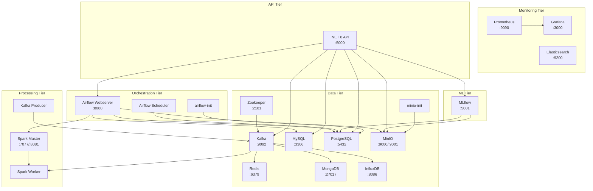
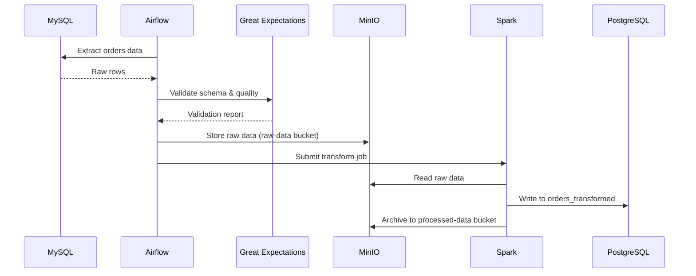
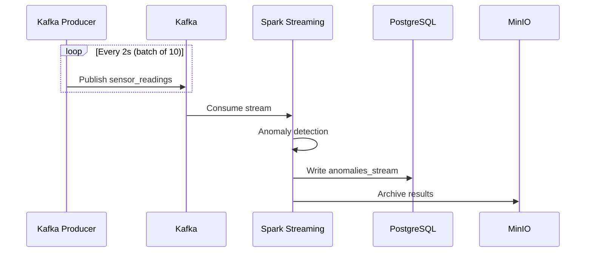
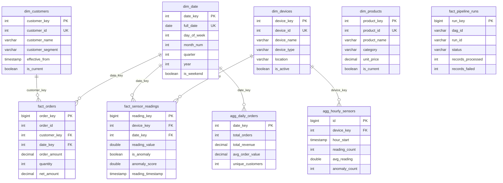
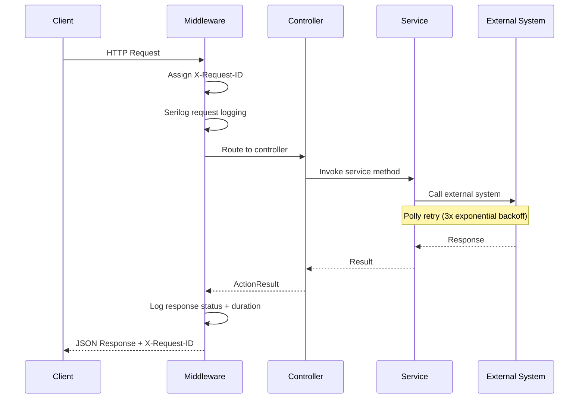
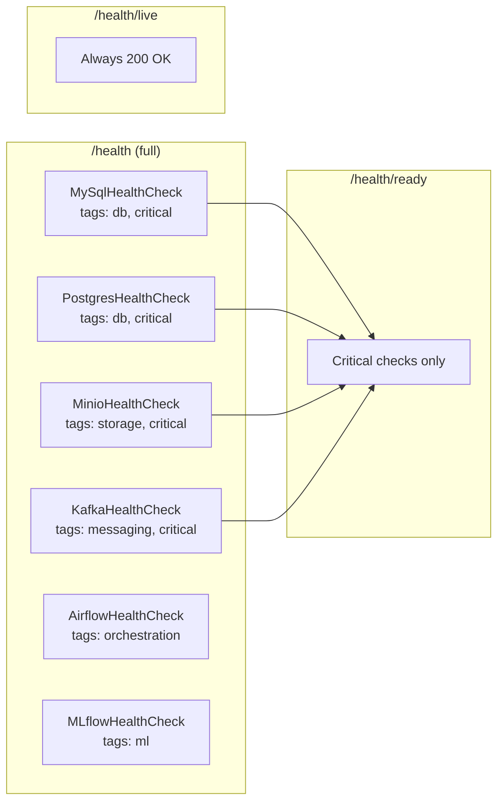
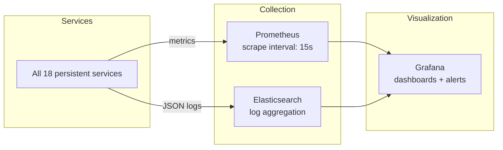
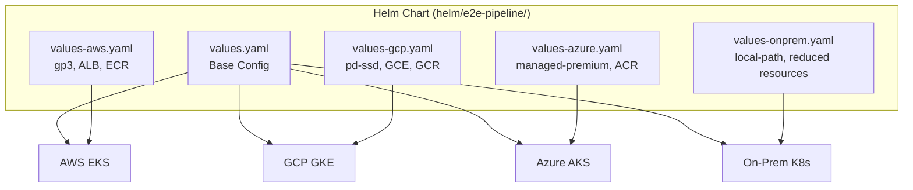
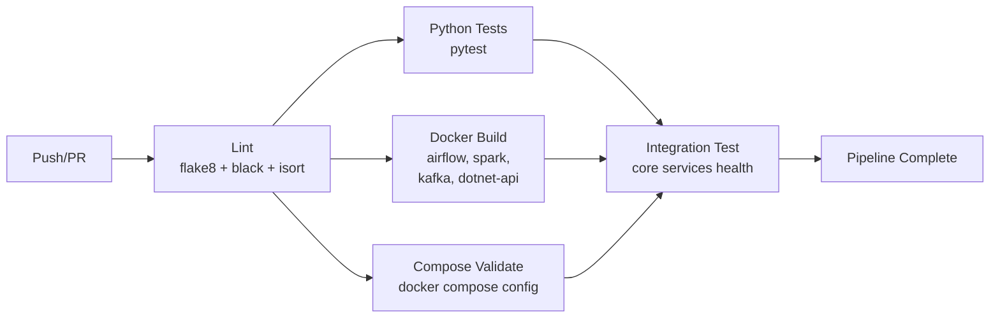

# Architecture

## 1. Overview

This system is an end-to-end data pipeline handling batch ingestion, real-time streaming, data warehousing, ML experiment tracking, and monitoring -- all deployed as 20 containerized services across 6 tiers via Docker Compose, with Kubernetes manifests for production deployment.

**Key design principles:**

- Event-driven architecture with Kafka as the central message bus
- Star-schema data warehouse in **Snowflake** (PostgreSQL fallback for local dev)
- Every persistent service has healthchecks, resource limits, JSON logging with rotation, and management labels
- Persistent volumes for all stateful services
- Polly retry policies and Serilog structured logging in the .NET API layer
- Multi-stage Docker builds for custom images
- CI/CD via GitHub Actions (lint, test, build, validate, integration)

## 2. System Architecture



## 3. Data Flow Architecture

### Airflow DAGs

| DAG ID | Schedule | Description |
|--------|----------|-------------|
| `batch_ingestion_dag` | Daily | MySQL → GE validation → MinIO → Spark → PostgreSQL |
| `streaming_monitoring_dag` | Every 15 min | Kafka health check + consumer lag monitoring |
| `warehouse_transform_dag` | Hourly | Stage → Snowflake dimensions → facts → aggregations (PG fallback) |

### 3.1 Batch Pipeline

```
MySQL (source) --> Airflow (batch_ingestion_dag) --> Great Expectations (validate)
    --> MinIO (raw-data bucket) --> Spark (transform + enrich)
    --> PostgreSQL (orders_transformed) + MinIO (processed-data bucket)
```



### 3.2 Streaming Pipeline

```
Kafka Producer (sensor_readings) --> Kafka --> Spark Streaming
    --> Anomaly Detection --> PostgreSQL (anomalies_stream) + MinIO
```



**Kafka side-flows** (additional consumers in `storage/`):

| Consumer | Source | Destination | Purpose |
|----------|--------|-------------|---------|
| `mongodb_streaming.py` | Kafka `sensor_readings` | MongoDB `iot_data.sensor_readings` | NoSQL document storage |
| `aws_s3_influxdb.py` | Kafka `sensor_readings` | InfluxDB `iot_data` bucket | Time-series analytics |
| `redis_integration.py` | Kafka `sensor_readings` | Redis cache + Kafka `processed_readings` | Real-time caching + enrichment |

**Side flows from Kafka:**

| Sink | Purpose |
|------|---------|
| MongoDB | Document store for semi-structured event data |
| InfluxDB | Time-series storage for IoT sensor metrics |
| Redis | Cache layer for latest readings / fast lookups |

### 3.3 Data Warehouse Pipeline

Batch and streaming outputs feed into the star schema in **Snowflake** (with PostgreSQL fallback for local development). The DAG auto-detects Snowflake configuration via `SNOWFLAKE_ACCOUNT` env var:

```
orders_transformed ----> dim_customers, dim_date, dim_products
                    \--> fact_orders --> agg_daily_orders

anomalies_stream ------> dim_devices, dim_date
                    \--> fact_sensor_readings --> agg_hourly_sensors

Airflow metadata ------> fact_pipeline_runs
```

## 4. Component Details

| # | Service | Image | Port(s) | Tier | Purpose | CPU/Mem Limit |
|---|---------|-------|---------|------|---------|---------------|
| 1 | Zookeeper | confluentinc/cp-zookeeper:7.5.0 | 2181 | Data | Kafka coordination | 0.5 / 512M |
| 2 | Kafka | confluentinc/cp-kafka:7.5.0 | 9092 | Data | Event streaming & message bus | 1.0 / 1G |
| 3 | MySQL | mysql:8.0 | 3306 | Data | Source OLTP database | 1.0 / 1G |
| 4 | PostgreSQL | postgres:15 | 5432 | Data | Staging DB + Airflow metadata + DW fallback | 1.0 / 1G |
| 5 | Redis | redis:7-alpine | 6379 | Data | Caching layer | 0.25 / 256M |
| 6 | MongoDB | mongo:6.0.13 | 27017 | Data | Document store | 0.5 / 512M |
| 7 | MinIO | minio/minio:2024-01-16 | 9000, 9001 | Data | S3-compatible object storage | 0.5 / 512M |
| 8 | InfluxDB | influxdb:2.7 | 8086 | Data | Time-series database | 0.5 / 512M |
| 9 | minio-init | minio/mc:2024-01-16 | -- | Data | Creates raw-data & processed-data buckets | -- |
| 10 | Spark Master | custom (./spark) | 7077, 8081 | Processing | Spark cluster coordinator | 1.0 / 2G |
| 11 | Spark Worker | custom (./spark) | -- | Processing | Spark task execution (2 cores, 2G) | 2.0 / 4G |
| 12 | Kafka Producer | custom (./kafka) | -- | Processing | Generates sensor_readings every 2s | 0.25 / 128M |
| 13 | Airflow Webserver | custom (./airflow) | 8080 | Orchestration | DAG UI and REST API | 1.0 / 2G |
| 14 | Airflow Scheduler | custom (./airflow) | -- | Orchestration | DAG scheduling and execution | 1.0 / 2G |
| 15 | airflow-init | custom (./airflow) | -- | Orchestration | DB migration, user + connection setup | -- |
| 16 | MLflow | ghcr.io/mlflow/mlflow:v2.9.2 | 5001 | ML | Experiment tracking, model registry | 0.5 / 512M |
| 17 | Prometheus | prom/prometheus:v2.48.1 | 9090 | Monitoring | Metrics collection (15d retention) | 0.5 / 512M |
| 18 | Grafana | grafana/grafana:10.2.3 | 3000 | Monitoring | Dashboards and alerting | 0.5 / 256M |
| 19 | Elasticsearch | elasticsearch:8.11.3 | 9200 | Monitoring | Log aggregation and search | 1.0 / 1G |
| 20 | .NET 8 API | custom (./sample_dotnet_backend) | 5000 | API | REST API gateway for all operations | 0.5 / 512M |

**Persistent volumes (11):** mysql_data, postgres_data, redis_data, mongodb_data, minio_data, influxdb_data, prometheus_data, grafana_data, elasticsearch_data, airflow_logs, spark_checkpoints

**External service:** Snowflake (cloud data warehouse) -- connected via `snowflake-connector-python`. When `SNOWFLAKE_ACCOUNT` is set, the warehouse DAG stages data from PostgreSQL into Snowflake's `PIPELINE_DB.STAGING` schema, then loads into `ANALYTICS` star schema with clustering keys and automated Snowflake Tasks.

## 5. Data Warehouse Schema



SCD Type 2 is used for dim_customers and dim_products (effective_from/effective_to/is_current). The dim_date table is pre-populated for 2024-2026.

## 6. API Layer (.NET 8 Backend)

The .NET 8 backend (`dotnet-api` on port 5000) acts as a unified orchestration gateway for the entire pipeline. Built with ASP.NET Core minimal hosting, Serilog structured logging, Polly retry policies, and Swagger/OpenAPI.

### API Architecture

```mermaid
graph TB
    subgraph "Client Layer"
        SW[Swagger UI<br/>/swagger]
        CLI[CLI / cURL]
        BI[BI Tools]
    end

    subgraph ".NET 8 API (Port 5000)"
        MW[Middleware Pipeline]
        MW --> |Request ID| RC[Request Context]
        MW --> |Serilog| LOG[Structured Logging]
        MW --> |Polly| RETRY[Retry Policies]

        subgraph Controllers
            BC[BatchController<br/>/api/batch]
            SC[StreamingController<br/>/api/stream]
            WC[WarehouseController<br/>/api/warehouse]
            MC[MLController<br/>/api/ml]
            GC[GovernanceController<br/>/api/governance]
            CC[CIController<br/>/api/ci]
            HC[MonitoringController<br/>/api/monitor]
        end

        subgraph Services
            DB[DbService<br/>MySQL + PostgreSQL]
            KS[KafkaService<br/>Confluent Producer]
            MS[MinioService<br/>AWS S3 SDK]
            BS[BatchService<br/>Airflow REST]
            SS[StreamingService<br/>Airflow REST]
            AS[AtlasService<br/>Lineage API]
            MLS[MLflowService<br/>Tracking API]
            GES[GEValidationService<br/>CLI Process]
            CIS[CIService<br/>GitHub API]
        end

        subgraph "Health Checks"
            HM[MySqlHealthCheck]
            HP[PostgresHealthCheck]
            HK[KafkaHealthCheck]
            HMI[MinioHealthCheck]
            HA[AirflowHealthCheck]
            HML[MLflowHealthCheck]
        end
    end

    subgraph "External Services"
        MYSQL[(MySQL)]
        PG[(PostgreSQL)]
        KAFKA[Kafka]
        MINIO[MinIO]
        AIRFLOW[Airflow]
        MLFLOW[MLflow]
        ATLAS[Atlas]
        GH[GitHub Actions]
        SF[Snowflake]
    end

    SW --> MW
    CLI --> MW
    BI --> MW

    BC --> DB & MS & GES & BS
    SC --> KS & SS
    WC --> DB & BS
    MC --> MLS
    GC --> AS
    CC --> CIS
    HC --> HM & HP & HK & HMI & HA & HML

    DB --> MYSQL & PG
    KS --> KAFKA
    MS --> MINIO
    BS --> AIRFLOW
    SS --> AIRFLOW
    AS --> ATLAS
    MLS --> MLFLOW
    CIS --> GH
    WC -.-> SF
```



### Request Flow



### Endpoints

| Route | Method | Controller | Purpose |
|-------|--------|------------|---------|
| `/api/batch/ingest` | POST | BatchController | Extract from MySQL, validate, upload to MinIO, trigger Airflow |
| `/api/stream/produce` | POST | StreamingController | Produce message to Kafka topic |
| `/api/stream/run` | POST | StreamingController | Trigger streaming monitoring DAG |
| `/api/warehouse/transform` | POST | WarehouseController | Trigger Snowflake warehouse ETL DAG |
| `/api/warehouse/health` | GET | WarehouseController | Check warehouse + Snowflake connectivity |
| `/api/warehouse/snowflake/status` | GET | WarehouseController | Snowflake configuration status + schema info |
| `/api/warehouse/aggregations/daily-orders` | GET | WarehouseController | Query daily order aggregations |
| `/api/warehouse/pipeline-runs` | GET | WarehouseController | Pipeline run history |
| `/api/ml/run` | POST | MLController | Create MLflow experiment run |
| `/api/monitor/health` | GET | MonitoringController | Aggregated health of all services |
| `/api/governance/lineage` | POST | GovernanceController | Register data lineage in Atlas |
| `/api/ci/trigger` | POST | CIController | Dispatch GitHub Actions workflow |
| `/health` | GET | Built-in | Full healthcheck (all 6 dependency checks) |
| `/health/ready` | GET | Built-in | Readiness probe (critical: MySQL, PG, MinIO, Kafka) |
| `/health/live` | GET | Built-in | Liveness probe (always returns 200) |
| `/swagger` | GET | Swashbuckle | Interactive API documentation |

### Service Layer

| Service | Interface | Dependencies | Resilience |
|---------|-----------|-------------|------------|
| DbService | IDbService | MySQL (Dapper), PostgreSQL (Npgsql) | Command timeout (30s), parameterized queries |
| KafkaService | IKafkaService | Confluent.Kafka | Idempotent producer, Acks=All, 3 retries |
| MinioService | IStorageService | AWSSDK.S3 | Exponential backoff, bucket auto-creation |
| BatchService | IBatchService | Airflow REST API | Polly 3x retry, basic auth |
| StreamingService | IStreamingService | Airflow REST API | Polly 3x retry, basic auth |
| AtlasService | IAtlasService | Atlas REST API | Polly 3x retry, basic auth |
| MLflowService | IMLflowService | MLflow REST API | Polly 3x retry |
| GEValidationService | IGEValidationService | CLI process | 300s timeout, stdout/stderr capture |
| CIService | ICIService | GitHub REST API | Bearer token auth |
| MonitoringService | IMonitoringService | All health checks | Aggregated status map |

### Health Check Architecture



### Configuration (Options Pattern)

All settings are injected via ASP.NET Options pattern with `ValidateDataAnnotations()` and `ValidateOnStart()`:

| Options Class | Config Section | Key Settings |
|---------------|----------------|-------------|
| DatabaseOptions | ConnectionStrings | MySQL + PostgreSQL connection strings, command timeout |
| KafkaOptions | Kafka | Bootstrap servers, topic, client ID, message timeout |
| MinioOptions | Minio | Endpoint, access/secret key, bucket names |
| AirflowOptions | Airflow | Base URL, username/password, DAG IDs |
| MLflowOptions | MLflow | Tracking URI, request timeout |
| AtlasOptions | Atlas | Endpoint, username/password |
| GEOptions | GreatExpectations | CLI path, timeout |
| GitHubOptions | GitHub | Actions API URL, token, user agent |

## 7. Monitoring & Observability Stack



| Layer | Tool | Details |
|-------|------|---------|
| Metrics | Prometheus | 15-day retention, scrapes all service endpoints |
| Dashboards | Grafana | Pre-configured with Prometheus datasource, clock panel plugin |
| Log aggregation | Elasticsearch 8.11 | Single-node, security disabled for dev |
| Structured logging | Serilog (.NET) | Console + file sinks, environment enrichment, request ID correlation |
| Container logging | Docker json-file driver | 10MB max-size, 3 file rotation on every service |

## 8. Deployment Architecture

### Docker Compose (Primary)

All 20 services run on a single bridge network (`pipeline-network`). Service startup is orchestrated via `depends_on` with `condition: service_healthy` or `service_completed_successfully` for init containers.

**Startup order:** Zookeeper --> Kafka --> MySQL/PostgreSQL/Redis/MongoDB/MinIO/InfluxDB --> minio-init/airflow-init --> Airflow Webserver/Scheduler --> Spark Master --> Spark Worker --> Kafka Producer --> MLflow --> Prometheus --> Grafana --> Elasticsearch --> .NET API

### Kubernetes (Production) -- Multi-Provider

Deployment to any Kubernetes cluster uses the **Helm chart** (`helm/e2e-pipeline/`) with provider-specific value overrides:



The chart includes 8 templates: namespace, configmap, secrets, airflow (webserver + scheduler), spark (master + worker), dotnet-api (with optional ingress), and kafka-producer. All infrastructure dependencies (PostgreSQL, MySQL, Redis, MongoDB, Kafka, MinIO, Grafana, Prometheus, Elasticsearch) use Bitnami sub-charts.

The universal deploy script (`scripts/deploy.sh`) provides a single entry point:

| Command | Target |
|---------|--------|
| `make deploy-local` | Docker Compose (20 services, ~18GB) |
| `make deploy-lite` | Docker Compose lite (16 services, ~8GB) |
| `make deploy-k8s` | Any Kubernetes cluster via Helm |
| `make deploy-aws` | AWS EKS (Terraform + Helm) |
| `make deploy-gcp` | GCP GKE via Helm |
| `make deploy-azure` | Azure AKS via Helm |
| `make deploy-onprem` | On-prem K8s (k3s, kubeadm, Rancher) |

### Terraform (AWS Infrastructure)

The `terraform/` directory provisions complete AWS infrastructure:

| File | Resources |
|------|-----------|
| `networking.tf` | VPC, public/private subnets, IGW, NAT Gateway, route tables |
| `eks.tf` | EKS cluster, IAM roles, node group with autoscaling |
| `rds.tf` | PostgreSQL 15 (encrypted, backups, deletion protection, multi-AZ) |
| `s3.tf` | Data lake bucket (versioned, KMS encrypted, lifecycle policies) |
| `security.tf` | 3 security groups (pipeline, EKS, RDS) with VPC-restricted access |
| `ec2.tf` | Optional EC2 instances (conditional via `deploy_ec2` flag) |
| `providers.tf` | Version constraints, S3 backend config, conditional EKS/local auth |
| `variables.tf` | 25+ variables with types, validation, and sensitive markers |

### Raw Kubernetes Manifests

Additional manifests in `kubernetes/` for advanced deployment strategies:

| Manifest | Purpose |
|----------|---------|
| `deployment.yaml` | Separate Deployments with resource limits, probes, ConfigMap, Secret |
| `services.yaml` | ClusterIP and NodePort service definitions |
| `ingress.yaml` | Ingress routing rules (ALB + Nginx) |
| `rollout-canary.yaml` | Argo Rollouts canary deployment strategy |
| `rollout-blue-green.yaml` | Argo Rollouts blue-green deployment strategy |
| `analysis-templates.yaml` | Argo Rollouts analysis for automated rollback |
| `servicemonitors.yaml` | Prometheus ServiceMonitor CRDs |
| `argo-rollouts-install.yaml` | Argo Rollouts controller installation |
| `argo-app.yaml` | ArgoCD Application definition |

### CI/CD Pipeline (GitHub Actions)



## 9. Security Considerations

| Area | Implementation |
|------|----------------|
| Secrets management | Environment variables via `.env` file (not committed); `.env.example` for templates |
| Network isolation | All services on a single Docker bridge network; no external exposure except mapped ports |
| Database auth | MySQL and PostgreSQL require username/password; MinIO requires access key/secret |
| Kafka security | PLAINTEXT listeners (internal + external); production should use SASL/TLS |
| Elasticsearch | Security disabled (`xpack.security.enabled=false`) for development |
| API error handling | ProblemDetails RFC 7807 responses; no stack traces in production |
| Request tracing | X-Request-ID header propagation via middleware |
| Dependency scanning | Multi-stage Docker builds minimize attack surface |
| Forwarded headers | X-Forwarded-For / X-Forwarded-Proto support for reverse proxy deployments |

## 10. Scalability Considerations

| Component | Scaling Strategy |
|-----------|-----------------|
| Kafka | Add brokers, increase partition count; topic replication factor currently 1 |
| Spark | Add workers via `docker compose up --scale spark-worker=N`; each worker: 2 cores, 2G RAM |
| Kafka Producer | Configurable MESSAGE_FREQUENCY and BATCH_SIZE environment variables |
| Airflow | LocalExecutor (single node); switch to CeleryExecutor or KubernetesExecutor for horizontal scaling |
| PostgreSQL | Vertical scaling via resource limits; read replicas for analytics workloads |
| MinIO | Supports distributed mode with multiple nodes |
| .NET API | Stateless; scale horizontally behind a load balancer |
| Prometheus | 15-day retention window; federate for longer retention or use Thanos/Cortex |
| Elasticsearch | Single-node dev; add nodes for production cluster |
| Kubernetes | Argo Rollouts with canary/blue-green strategies; ServiceMonitors for auto-scaling metrics |
