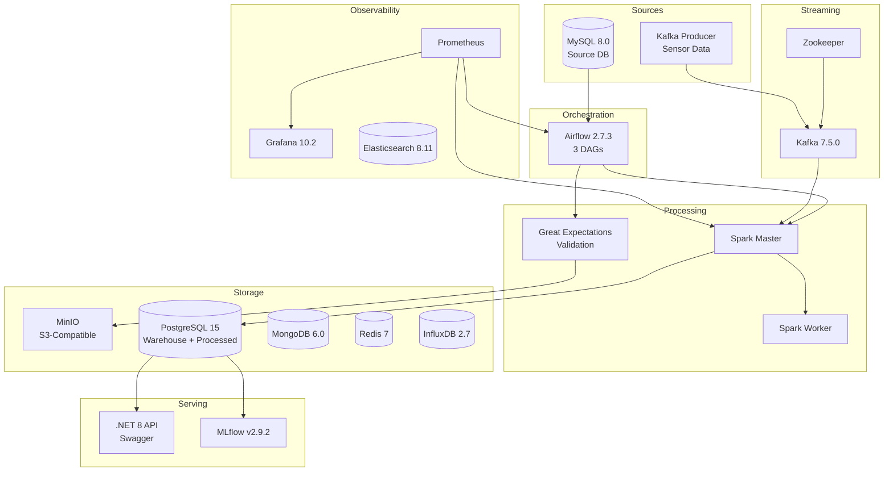
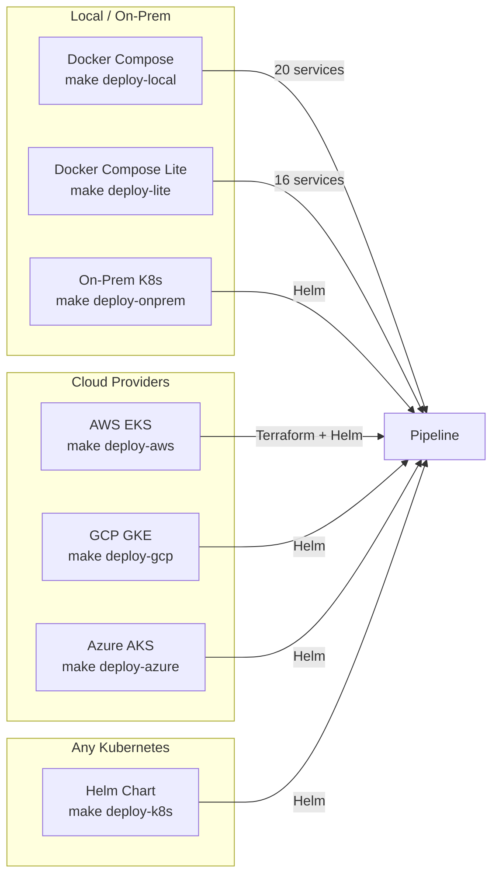
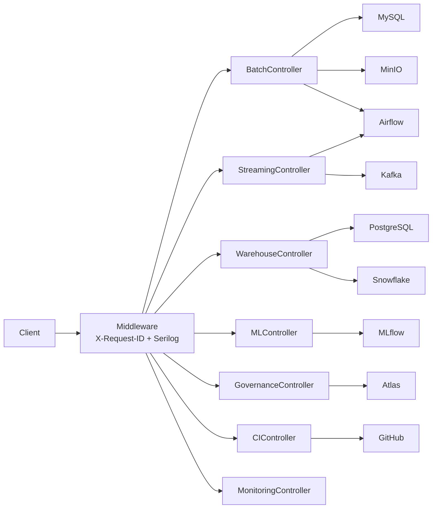

# End-to-End Data Pipeline

[](https://www.python.org/)
[](https://dotnet.microsoft.com/)
[](https://learn.microsoft.com/en-us/dotnet/csharp/)
[](https://developer.mozilla.org/en-US/docs/Web/HTML)
[](https://developer.mozilla.org/en-US/docs/Web/CSS)
[](https://developer.mozilla.org/en-US/docs/Web/JavaScript)
[](https://airflow.apache.org/)
[](https://spark.apache.org/)
[](https://kafka.apache.org/)
[](https://www.snowflake.com/)
[](https://www.postgresql.org/)
[](https://www.mysql.com/)
[](https://www.mongodb.com/)
[](https://redis.io/)
[](https://min.io/)
[](https://www.influxdata.com/)
[](https://www.elastic.co/)
[](https://mlflow.org/)
[](https://prometheus.io/)
[](https://grafana.com/)
[](https://swagger.io/)
[](https://serilog.net/)
[](https://github.com/DapperLib/Dapper)
[](https://www.docker.com/)
[](https://kubernetes.io/)
[](https://www.terraform.io/)
[](https://github.com/features/actions)
[](https://helm.sh/)
[](https://argoproj.github.io/cd/)

A **production-ready, fully containerized data platform** with batch ingestion, real-time streaming, a star-schema data warehouse, ML experiment tracking, a .NET 8 REST API, and full observability -- all orchestrated through **20 Docker services** managed by a single `docker compose` stack.

## Table of Contents

- [Architecture](#architecture)
- [Pipeline Flows](#pipeline-flows)
- [Technology Stack](#technology-stack)
- [Prerequisites](#prerequisites)
- [Quick Start](#quick-start)
- [Service URLs](#service-urls)
- [API Documentation (.NET 8 Backend)](#api-documentation-net-8-backend)
- [Data Warehouse Schema](#data-warehouse-schema)
- [Airflow DAGs](#airflow-dags)
- [Testing](#testing)
- [CI/CD Pipeline](#cicd-pipeline)
- [Project Structure](#project-structure)
- [Configuration](#configuration)
- [Contributing](#contributing)
- [License](#license)

## Architecture



## Pipeline Flows

### Batch Pipeline (Daily)

```
MySQL --> Airflow DAG --> Great Expectations --> MinIO (raw) --> Spark Transform --> PostgreSQL (processed)
```

### Streaming Pipeline (Continuous)

```
Kafka Producer --> Kafka Topic (sensor_readings) --> Spark Streaming --> Anomaly Detection --> PostgreSQL + MinIO
```

### Warehouse ETL (Hourly)

```
Staging Tables --> Dimension Load (customers, products, dates, devices) --> Fact Load (orders, sensors, pipeline runs) --> Aggregations (daily orders, hourly sensors)
```

## Technology Stack

| Layer | Technology | Version | Purpose |
|-------|-----------|---------|---------|
| **Orchestration** | Apache Airflow | 2.7.3 | DAG scheduling and pipeline orchestration |
| **Batch Processing** | Apache Spark | 3.5.3 | Large-scale ETL and transformations |
| **Stream Processing** | Apache Kafka | 7.5.0 (Confluent) | Event streaming and real-time ingestion |
| **Data Quality** | Great Expectations | latest | Schema validation and data quality checks |
| **Source Database** | MySQL | 8.0 | Transactional source system |
| **Data Warehouse** | Snowflake / PostgreSQL | - / 15 | Star-schema warehouse (Snowflake primary, PG fallback) |
| **Object Storage** | MinIO | latest | S3-compatible data lake |
| **Cache** | Redis | 7-alpine | Caching and session storage |
| **Document Store** | MongoDB | 6.0.13 | NoSQL storage for semi-structured data |
| **Time Series** | InfluxDB | 2.7 | IoT and time-series metrics |
| **Search** | Elasticsearch | 8.11.3 | Full-text search and log indexing |
| **REST API** | .NET 8 | 8.0 | Backend API with Swagger documentation |
| **ML Tracking** | MLflow | 2.9.2 | Experiment tracking and model registry |
| **Metrics** | Prometheus | 2.48.1 | Metrics collection and alerting |
| **Dashboards** | Grafana | 10.2.3 | Visualization and monitoring dashboards |
| **Governance** | Apache Atlas (stub) | -- | Data lineage registration |
| **IaC** | Terraform + Kubernetes | -- | Cloud deployment manifests |

## Prerequisites

- **Docker** and **Docker Compose** v2+
- **Python 3.10+** (for running tests locally)
- **Make** (GNU Make)
- **16 GB RAM** recommended for full stack (or **8 GB** with `make up-lite`)
- Ports available: `3000, 3306, 5000, 5001, 5432, 6379, 7077, 8080, 8081, 8086, 9000, 9001, 9090, 9092, 9200, 27017`

## Quick Start

```bash
# 1. Clone the repository
git clone https://github.com/hoangsonww/End-to-End-Data-Pipeline.git
cd End-to-End-Data-Pipeline

# 2. Create environment file
cp .env.example .env

# 3. Build and start all 20 services
make build
make up

# 4. Verify services are running
make health
make urls

# 5. Trigger the batch pipeline
make trigger-batch

# 6. Trigger the warehouse ETL
make trigger-warehouse

# 7. Run Spark jobs directly
make spark-batch
make spark-stream
```

### Key Make Commands

| Command | Description |
|---------|-------------|
| `make up` | Start all 20 services (~18GB RAM) |
| `make up-lite` | Start core services only (~8GB RAM) |
| `make down` | Stop all services |
| `make build` | Build all Docker images |
| `make rebuild` | Full rebuild from scratch (no cache) |
| `make test` | Run 35 Python tests |
| `make lint` | Lint Python code with flake8 |
| `make health` | Show health status of all containers |
| `make status` | Show running container status |
| `make urls` | Print all service URLs |
| `make spark-batch` | Submit Spark batch ETL job |
| `make spark-stream` | Submit Spark streaming job |
| `make trigger-batch` | Trigger `batch_ingestion_dag` in Airflow |
| `make trigger-warehouse` | Trigger `warehouse_transform_dag` in Airflow |
| `make list-dags` | List all Airflow DAGs |
| `make kafka-topics` | List Kafka topics |
| `make logs-kafka` | Tail Kafka logs |
| `make clean` | Stop services and remove all volumes |
| `make format` | Format all code (Python, C#, HTML/CSS/JS) |
| `make format-check` | Check formatting without modifying |
| `make deploy-local` | Deploy via Docker Compose (full stack) |
| `make deploy-lite` | Deploy via Docker Compose (lite, 8GB) |
| `make deploy-k8s` | Deploy to any Kubernetes cluster via Helm |
| `make deploy-aws` | Deploy to AWS EKS (Terraform + Helm) |
| `make deploy-gcp` | Deploy to GCP GKE via Helm |
| `make deploy-azure` | Deploy to Azure AKS via Helm |
| `make deploy-onprem` | Deploy to on-prem K8s (k3s, kubeadm) |
| `make deploy-teardown` | Remove deployment from any target |

## Deployment

The pipeline can be deployed to **any environment** using a single command:



| Target | Command | Requirements | Resources |
|--------|---------|-------------|-----------|
| **Local (full)** | `make deploy-local` | Docker | 16GB RAM, 14 CPU |
| **Local (lite)** | `make deploy-lite` | Docker | 8GB RAM, 7 CPU |
| **Any K8s** | `make deploy-k8s` | kubectl, Helm | K8s cluster |
| **AWS** | `make deploy-aws` | Terraform, AWS CLI | EKS cluster |
| **GCP** | `make deploy-gcp` | gcloud, Helm | GKE cluster |
| **Azure** | `make deploy-azure` | az CLI, Helm | AKS cluster |
| **On-prem** | `make deploy-onprem` | kubectl, Helm | k3s / kubeadm / Rancher |

### Helm Chart

The `helm/e2e-pipeline/` chart deploys the full pipeline to any Kubernetes cluster:

```bash
# Add repos and install
helm repo add bitnami https://charts.bitnami.com/bitnami
helm repo update

# Deploy with provider-specific values
helm install e2e-pipeline ./helm/e2e-pipeline \
  -f helm/e2e-pipeline/values-aws.yaml \     # or values-gcp.yaml, values-azure.yaml, values-onprem.yaml
  --set postgresql.auth.password=YOUR_PASSWORD \
  --set minio.auth.rootPassword=YOUR_PASSWORD \
  --namespace pipeline --create-namespace
```

### Terraform (AWS)

Full AWS infrastructure (VPC, EKS, RDS, S3) in `terraform/`:

```bash
cd terraform
cp terraform.tfvars.example terraform.tfvars
# Edit terraform.tfvars with your settings
terraform init && terraform plan && terraform apply
```

Includes: VPC with public/private subnets, NAT Gateway, EKS with autoscaling nodes, RDS PostgreSQL (encrypted, multi-AZ), S3 data lake (versioned, encrypted, lifecycle policies), 3 security groups.

## Service URLs

| Service | URL | Credentials |
|---------|-----|-------------|
| **Airflow UI** | [http://localhost:8080](http://localhost:8080) | `admin` / `airflow_admin_2024` |
| **Grafana** | [http://localhost:3000](http://localhost:3000) | `admin` / `admin_secret_2024` |
| **MinIO Console** | [http://localhost:9001](http://localhost:9001) | `minio` / `minio_secret_2024` |
| **MLflow UI** | [http://localhost:5001](http://localhost:5001) | -- |
| **Spark Master UI** | [http://localhost:8081](http://localhost:8081) | -- |
| **Swagger (.NET API)** | [http://localhost:5000/swagger](http://localhost:5000/swagger) | -- |
| **Prometheus** | [http://localhost:9090](http://localhost:9090) | -- |
| **Elasticsearch** | [http://localhost:9200](http://localhost:9200) | -- |
| **Kafka** | `localhost:9092` | -- |
| **PostgreSQL** | `localhost:5432` | `pipeline_user` / `pipeline_secret_2024` |
| **MySQL** | `localhost:3306` | `pipeline_user` / `pipeline_secret_2024` |
| **MongoDB** | `localhost:27017` | -- |
| **Redis** | `localhost:6379` | -- |
| **InfluxDB** | [http://localhost:8086](http://localhost:8086) | -- |

## API Documentation (.NET 8 Backend)

The .NET 8 API runs on port **5000** with interactive Swagger documentation at [`/swagger`](http://localhost:5000/swagger). Built with ASP.NET Core, Serilog structured logging, Polly retry policies, and Dapper micro-ORM.



### Endpoints (16 routes)

| Method | Endpoint | Controller | Description |
|--------|----------|------------|-------------|
| `POST` | `/api/batch/ingest` | BatchController | Extract MySQL → validate → upload MinIO → trigger Airflow |
| `POST` | `/api/stream/produce` | StreamingController | Produce message to Kafka topic |
| `POST` | `/api/stream/run` | StreamingController | Trigger streaming monitoring DAG |
| `POST` | `/api/warehouse/transform` | WarehouseController | Trigger Snowflake warehouse ETL |
| `GET` | `/api/warehouse/health` | WarehouseController | Check warehouse + Snowflake connectivity |
| `GET` | `/api/warehouse/snowflake/status` | WarehouseController | Snowflake config status + schema info |
| `GET` | `/api/warehouse/aggregations/daily-orders` | WarehouseController | Daily order aggregations |
| `GET` | `/api/warehouse/pipeline-runs` | WarehouseController | Pipeline run history |
| `POST` | `/api/governance/lineage` | GovernanceController | Register data lineage in Atlas |
| `POST` | `/api/ml/run` | MLController | Create MLflow experiment run |
| `POST` | `/api/ci/trigger` | CIController | Dispatch GitHub Actions workflow |
| `GET` | `/api/monitor/health` | MonitoringController | Aggregated health of all services |
| `GET` | `/health` | Built-in | Full health check (6 dependency checks) |
| `GET` | `/health/ready` | Built-in | Readiness probe (critical deps only) |
| `GET` | `/health/live` | Built-in | Liveness probe (always 200) |
| `GET` | `/swagger` | Swashbuckle | Interactive API documentation |

### Backend Architecture

| Layer | Components | Technology |
|-------|-----------|------------|
| **Controllers** | 7 controllers (Batch, Streaming, Warehouse, ML, Governance, CI, Monitoring) | ASP.NET Core |
| **Services** | 10 services with interfaces (Db, Kafka, Minio, Batch, Streaming, Atlas, MLflow, GE, CI, Monitoring) | Dapper, Confluent.Kafka, AWS SDK |
| **Health Checks** | 6 checks (MySQL, PostgreSQL, Kafka, MinIO, Airflow, MLflow) | ASP.NET Health Checks |
| **Options** | 8 validated config classes with `ValidateOnStart()` | Options Pattern |
| **Resilience** | Polly retry (3x exponential backoff), request timeouts | Polly |
| **Logging** | Serilog with console + file sinks, request ID correlation | Serilog |

## Data Warehouse Schema

The warehouse uses a **star schema** in **Snowflake** (with PostgreSQL fallback for local development). When `SNOWFLAKE_ACCOUNT` is set, data flows to Snowflake via staging tables. Otherwise, PostgreSQL serves as the warehouse.

### Dimensions

| Table | Description |
|-------|-------------|
| `dim_customers` | Customer master data |
| `dim_products` | Product catalog |
| `dim_date` | Date dimension (calendar attributes) |
| `dim_devices` | IoT device registry |

### Facts

| Table | Description |
|-------|-------------|
| `fact_orders` | Transactional order data linked to customer, product, date |
| `fact_sensor_readings` | IoT sensor measurements linked to device, date |
| `fact_pipeline_runs` | Pipeline execution metadata and status tracking |

### Aggregations

| Table | Description |
|-------|-------------|
| `agg_daily_orders` | Daily order totals and revenue summaries |
| `agg_hourly_sensors` | Hourly sensor reading averages and counts |

## Airflow DAGs

| DAG | Schedule | Description |
|-----|----------|-------------|
| `batch_ingestion_dag` | Daily | Extract from MySQL, validate with Great Expectations, upload raw data to MinIO, Spark transform, load to PostgreSQL |
| `streaming_monitoring_dag` | Every 15 min | Monitor Kafka broker health, check consumer lag, alert on anomalies |
| `warehouse_transform_dag` | Hourly | Stage data in Snowflake, load dimensions/facts, refresh aggregations (PG fallback) |

## Testing

The test suite contains **35 tests** across 5 files.

```bash
make test
```

| Test File | Scope |
|-----------|-------|
| `tests/test_pipeline_config.py` | Environment variables, connection strings, service configuration |
| `tests/test_kafka_producer.py` | Kafka producer logic, message serialization, topic configuration |
| `tests/test_data_validation.py` | Great Expectations suite, schema validation, data quality rules |
| `tests/test_warehouse_sql.py` | Warehouse DDL, star-schema integrity, aggregation queries |
| `tests/test_snowflake.py` | Snowflake SQL schema, connector module, DAG/BI/API integration |
| `tests/test_docker_infrastructure.py` | Docker Compose structure, service definitions, port mappings |

## CI/CD Pipeline

The GitHub Actions workflow (`.github/workflows/cicd-pipeline.yml`) runs on every push and PR to `master`/`main`.

| Stage | Job | Details |
|-------|-----|---------|
| **Lint** | `lint` | flake8, black (formatting), isort (imports) |
| **Test** | `python-tests` | 35 unit tests with pytest |
| **Build** | `docker-build` | Build matrix: `airflow`, `spark`, `kafka-producer`, `dotnet-api` |
| **Validate** | `docker-compose-validation` | Validate `docker-compose.yaml` syntax |
| **Integration** | `integration-test` | Start core services, verify health (Kafka, PostgreSQL, MySQL, Redis) |
| **Gate** | `pipeline-complete` | Aggregates all job results for branch protection |

## Project Structure

```
├── airflow/
│   ├── Dockerfile
│   ├── requirements.txt
│   └── dags/
│       ├── batch_ingestion_dag.py        # Daily batch ETL
│       ├── streaming_monitoring_dag.py   # Kafka health monitoring
│       └── warehouse_transform_dag.py    # Hourly warehouse ETL
├── spark/
│   ├── Dockerfile
│   ├── spark_batch_job.py                # Batch ETL (MinIO → transform → PostgreSQL)
│   └── spark_streaming_job.py            # Real-time Kafka consumer + anomaly detection
├── kafka/
│   ├── Dockerfile
│   └── producer.py                       # Sensor data generator
├── storage/
│   ├── aws_s3_influxdb.py               # S3 + InfluxDB integration
│   ├── hadoop_batch_processing.py        # Hadoop batch processing
│   ├── mongodb_streaming.py              # MongoDB streaming integration
│   └── redis_integration.py              # Redis caching layer
├── great_expectations/
│   ├── great_expectations.yaml
│   └── expectations/
│       └── raw_data_validation.py        # Data quality suite
├── governance/
│   └── atlas_stub.py                     # Apache Atlas lineage registration
├── ml/
│   ├── mlflow_tracking.py                # MLflow experiment tracking
│   └── feature_store_stub.py             # Feature store integration
├── monitoring/
│   ├── monitoring.py                     # Prometheus + Grafana setup
│   ├── prometheus.yml                    # Prometheus scrape config
│   └── grafana-deployment-dashboards.json
├── bi_dashboards/
│   └── bi_dashboard.py                   # BI dashboard utilities
├── sample_dotnet_backend/
│   ├── Dockerfile                        # Multi-stage .NET 8 build
│   ├── appsettings.json                  # Full config (DB, Kafka, MinIO, Airflow, Snowflake)
│   ├── appsettings.Production.json       # Production overrides (Serilog level)
│   └── src/DataPipelineApi/
│       ├── DataPipelineApi.csproj        # .NET 8, Dapper, Confluent.Kafka, Serilog, Polly
│       ├── Program.cs                    # ASP.NET Core setup, middleware, health endpoints
│       ├── Controllers/                  # 7 controllers
│       │   ├── BatchController.cs        #   POST /api/batch/ingest
│       │   ├── StreamingController.cs    #   POST /api/stream/produce, /run
│       │   ├── WarehouseController.cs    #   POST /api/warehouse/transform, GET /health, /snowflake/status
│       │   ├── MLController.cs           #   POST /api/ml/run
│       │   ├── GovernanceController.cs   #   POST /api/governance/lineage
│       │   ├── CIController.cs           #   POST /api/ci/trigger
│       │   └── MonitoringController.cs   #   GET /api/monitor/health
│       ├── Services/                     # 10 services (Db, Kafka, MinIO, Batch, Streaming, Atlas, MLflow, GE, CI, Monitoring)
│       ├── Models/                       # BatchRequest, StreamingRequest DTOs
│       ├── Options/                      # 8 config classes (Database, Kafka, MinIO, Airflow, MLflow, Atlas, GE, GitHub)
│       └── HealthChecks/                 # 6 checks (MySQL, PostgreSQL, Kafka, MinIO, Airflow, MLflow)
├── scripts/
│   ├── init_db.sql                       # MySQL schema + seed data
│   ├── init_warehouse.sql                # PostgreSQL warehouse DDL
│   ├── deploy.sh                         # Universal deploy script (local/K8s/AWS/GCP/Azure)
│   ├── deploy-blue-green.sh              # Blue/green deployment orchestration
│   ├── deploy-canary.sh                  # Canary deployment with metrics
│   └── setup-advanced-deployments.sh     # Argo Rollouts + monitoring setup
├── snowflake/
│   ├── snowflake_connector.py            # Snowflake connection + loading utilities
│   └── init_warehouse.sql                # Snowflake warehouse DDL (star schema + tasks + grants)
├── helm/e2e-pipeline/                    # Helm chart (any K8s provider)
│   ├── Chart.yaml                        # Chart metadata + sub-chart deps
│   ├── values.yaml                       # Default values (all providers)
│   ├── values-aws.yaml                   # AWS EKS overrides (gp3, ALB, ECR)
│   ├── values-gcp.yaml                   # GCP GKE overrides (pd-ssd, GCE, GCR)
│   ├── values-azure.yaml                 # Azure AKS overrides (managed-premium, ACR)
│   ├── values-onprem.yaml                # On-prem overrides (local-path, reduced resources)
│   └── templates/                        # 8 templates (airflow, spark, dotnet-api, kafka-producer, configmap, secrets, namespace)
├── kubernetes/                           # Raw K8s manifests (Argo Rollouts, ingress, service monitors)
├── terraform/                            # AWS IaC (VPC, EKS, RDS, S3, security groups, IAM)
├── tests/
│   ├── test_pipeline_config.py
│   ├── test_kafka_producer.py
│   ├── test_data_validation.py
│   ├── test_warehouse_sql.py
│   ├── test_snowflake.py
│   └── test_docker_infrastructure.py
├── packages/                             # Frontend assets
├── .github/workflows/cicd-pipeline.yml   # CI/CD pipeline
├── docker-compose.yaml                   # 20 services
├── docker-compose.ci.yaml                # CI-specific compose
├── .env.example                          # Environment template
├── Makefile                              # Build and operations commands
├── requirements.txt                      # Python dependencies
├── index.html                            # Landing page
├── ARCHITECTURE.md                       # Detailed architecture docs
├── QUICK_START.md                        # Quick start guide
└── DEPLOYMENT_STRATEGIES.md              # Deployment strategies
```

## Configuration

All configuration is driven by environment variables defined in `.env.example`.

| Section | Key Variables |
|---------|--------------|
| **PostgreSQL** | `POSTGRES_DB`, `POSTGRES_USER`, `POSTGRES_PASSWORD` |
| **MySQL** | `MYSQL_DATABASE`, `MYSQL_USER`, `MYSQL_PASSWORD`, `MYSQL_ROOT_PASSWORD` |
| **Kafka** | `KAFKA_BROKER`, `KAFKA_TOPIC`, `KAFKA_ACKS_MODE` |
| **Spark** | `SPARK_MASTER_URL`, `SPARK_DRIVER_MEMORY`, `SPARK_EXECUTOR_MEMORY` |
| **Airflow** | `AIRFLOW__CORE__EXECUTOR`, `AIRFLOW_ADMIN_USER`, `AIRFLOW_ADMIN_PASSWORD` |
| **MinIO** | `MINIO_ROOT_USER`, `MINIO_ROOT_PASSWORD`, `MINIO_BUCKET_RAW`, `MINIO_BUCKET_PROCESSED` |
| **Grafana** | `GRAFANA_ADMIN_USER`, `GRAFANA_ADMIN_PASS` |
| **MLflow** | `MLFLOW_TRACKING_URI` |
| **Redis** | `REDIS_HOST`, `REDIS_PORT` |
| **MongoDB** | `MONGODB_URI`, `MONGODB_DB` |
| **InfluxDB** | `INFLUXDB_URL`, `INFLUXDB_TOKEN`, `INFLUXDB_ORG`, `INFLUXDB_BUCKET` |
| **Snowflake** | `SNOWFLAKE_ACCOUNT`, `SNOWFLAKE_USER`, `SNOWFLAKE_PASSWORD`, `SNOWFLAKE_WAREHOUSE`, `SNOWFLAKE_DATABASE` |
| **Governance** | `ATLAS_API_URL`, `ATLAS_USERNAME`, `ATLAS_PASSWORD` |

### Snowflake Setup

To enable the Snowflake data warehouse (optional -- PostgreSQL is used as fallback):

```bash
# 1. Set Snowflake credentials in .env
SNOWFLAKE_ACCOUNT=your_account.us-east-1
SNOWFLAKE_USER=your_user
SNOWFLAKE_PASSWORD=your_password

# 2. Initialize the Snowflake warehouse schema
snowsql -a $SNOWFLAKE_ACCOUNT -u $SNOWFLAKE_USER -f snowflake/init_warehouse.sql

# 3. The warehouse_transform_dag will automatically use Snowflake when configured
```

To customize, copy the example and edit:

```bash
cp .env.example .env
# Edit .env with your values
```

## Contributing

1. Fork the repository
2. Create a feature branch (`git checkout -b feature/your-feature`)
3. Commit your changes (`git commit -m 'Add your feature'`)
4. Push to the branch (`git push origin feature/your-feature`)
5. Open a Pull Request

## License

This project is licensed under the [MIT License](https://opensource.org/licenses/MIT).

---

For questions or feedback, reach out on [GitHub](https://github.com/hoangsonww).
